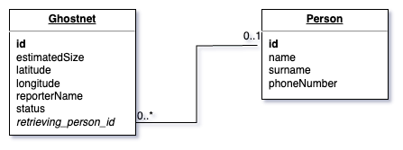

# IU Ghost Net Fishing Project
Herzlich Willkommen in dem Repository der Fallstudie "Ghost Net Fishing".
In dieser Fallstudie geht es darum, eine einfache Webapplikation mit Java EE zu entwickeln, die mittels einer Datenbankanbindung die Benutzereingaben persistieren kann.

| Information    | Beschreibung      |
|----------------|-------------------|
| **Autor**      | Karl Felix Heinke |
| **Kurskürzel** | IPWA02-01         |

## Anwendungs- und Paketversionen
**Anwendungsspezifische** Versionen

| Anwendung | Version |
|-----------|---------|
| Java      | 11      |
| Tomcat    | 10.1.31 |
| MySQL     | 9       |

**Maven** Paketmanager Versionen

| Maven Pakete               | Version     |
|----------------------------|-------------|
| maven-war-plugin           | 3.3.1       |
| jakarta.servlet-api        | 5.0.0       |
| jakarta.faces              | 4.0.0-M1    |
| jakarta.inject-api         | 2.0.0       |
| jakarta.enterprise.cdi-api | 3.0.0       |
| weld-servlet-core          | 4.0.0.Final |
| primefaces                 | 14.0.2      |
| primeflex                  | 3.3.1       |
| language-de                | 6.4         |
| hibernate-core             | 6.5.2.Final |
| mysql-connector-java       | 8.0.33      |

## Voraussetzung Betrieb
Um dieses Projekt ausführen zu können, wird eine **MySQL**-Datenbank benötigt.
Die Anbindung muss über die Datei [`src/main/resources/META-INF/persistence.xml`](src/main/resources/META-INF/persistence.xml) konfiguriert werden.

Um einen schnellen Start zu ermöglichen, habe ich eine [Docker-Compose-Datei](compose.yaml) bereitgestellt, um eine MySQL Datenbank zu starten.
Die Konfiguration der `ghostnet` Datenbank kann dann mithilfe von [DBeaver](https://dbeaver.io/download/) oder einem anderen Tool erledigt werden.

Um sich an der Anwendung als **bergende Person** anmelden zu können, muss händisch in der Datenbank in der Tabelle `Person` ein neuer Eintrag erstellt werden.

## Datenbank Aufbau
Die Datenbank hat einen simplen Aufbau mit zwei Tabellen (und einer automatisch generierten Tabelle, die für die fortlaufende Nummerierung der Geistzernetze verantwortlich ist).

